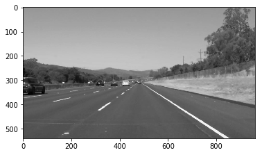
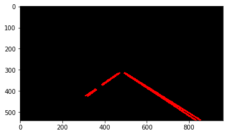
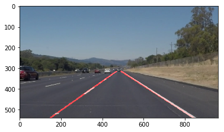

# Finding Lane Lines on the Road 

This project is developed to identify the lane lines on the road. A pipeline is created to test the result initially on images and later applied the results to video stream(series of images).
<br />

<br />
Raw image of a road.

<br />

<br />
Identified lane line of the road.

## Overview

---

### 1. Description of pipeline for images.

The pipeline for image consist of 6 steps-

#### Step 2. Read test_image.

It reads the image of road whose lane line we have to find.

```python
#reading in an image
image = mpimg.imread('test_images/solidWhiteRight.jpg')

#printing out some stats and plotting
print('This image is:', type(image), 'with dimensions:', image.shape)
plt.imshow(image)  # if you wanted to show a single color channel image called 'gray', for example, call as plt.imshow(gray, cmap='gray')
```


<br />

#### Step 2. Convert image to grayscale

`grayscale()` function is used to convert the test_image to the grayscaled image. This function uses the `cv2.cvtColor()` opencv function which convert images from one color space to another.

```python
#show the grayscaled image
gray = grayscale(image)
plt.imshow(gray, cmap='gray')
```


<br />

#### Step 3. Show the edges image

Here we have also included gaussian_blur function which is used for the **Gaussina smooting**, a way of suppressing noise and spurious gradient. 
<br />
Then `canny()` function is used to convert gray image to edges image. Here it uses the `cv2.canny()` opencv function which returns a binary image with white pixels tracing out the detected edges and black everywhere else.

```python  
# apply Gaussian smoothing
blur_gray = gaussian_blur(gray, 3)

#show the edges image
edges = canny(blur_gray, 50, 150)
plt.imshow(edges, cmap='gray')
```

<br />

#### Step 4. Region masking

The `region_of_interest()` function is used to mask a area according to your desired shape in a image. Here we have used a quardilateral shaped masking region with following vertices.

```python
#show masked edges
vertices = np.array([[(150, 540),(450, 315), (500, 315), (880, 540)]])
masked_edges = region_of_interest(edges, vertices)
plt.imshow(masked_edges, cmap='gray')
```

<br />

#### Step 5. Run Hough on edge detected image

```python
rho = 1 # distance resolution in pixels of the Hough grid
theta =  np.pi/180 # angular resolution in radians of the Hough grid
threshold = 15     # minimum number of votes (intersections in Hough grid cell)
min_line_len = 40 #minimum number of pixels making up a line
max_line_gap = 20    # maximum gap in pixels between connectable line segments

# Run Hough on edge detected image
line_img = hough_lines(masked_edges, rho, theta, threshold, min_line_len, max_line_gap)
plt.imshow(line_img)
```
Before changing in `draw_line()` function the output of `hough_lines()` was like - 


<br />
But in order to draw a single line for the left and right lane the `draw_line()` function has been modified to -

```python
def draw_lines(img, lines, color=[255, 0, 0], thickness=2):
   
    left_line_slopes = []
    right_line_slopes = []
    left_line_pts = []
    right_line_pts = []
    
    left_x_pts = []
    left_y_pts = []
    right_x_pts = []
    right_y_pts = []
    
#     Store the slope of each line in an array.
    for line in lines:
        for x1,y1,x2,y2 in line:
            if((y2-y1)/(x2-x1) < 0):
                left_line_slopes.append(round(((y2-y1)/(x2-x1))*10))
            else:
                right_line_slopes.append(round(((y2-y1)/(x2-x1))*10))
    
#     Initializes variables to empty string.
    most_left_pt_freq = ''                
    most_right_pt_freq = ''
    
#     Find which slope has the maximum frequency.
    if len(left_line_slopes):
        most_left_pt_freq = max(set(left_line_slopes), key=left_line_slopes.count)
    
    if len(right_line_slopes):
        most_right_pt_freq = max(set(right_line_slopes), key=right_line_slopes.count)
    
#     Check that if slope of line is in range, then save its point in an array
    for line in lines:
        for x1,y1,x2,y2 in line:
            if not most_left_pt_freq is '':
                if((most_left_pt_freq-1) <= (round(((y2-y1)/(x2-x1))*10)) <= (most_left_pt_freq+1)):
                    left_line_pts.append((x1,y1))
                    left_line_pts.append((x2,y2))
    if not most_left_pt_freq is '':    
        for x1,y1 in left_line_pts:
            left_x_pts.append(x1)
            left_y_pts.append(y1)
            
#         Calculating y coordinates of the end points of left line 
        left_y1 = min(left_y_pts)
        left_y2 = img.shape[0]

#         Calculate m and b for the left lines(y=mx+b)
        left_m, left_b = np.polyfit(left_x_pts, left_y_pts, 1)

#         Calculate x coordinates of the end points of left line.
        left_x1 = int((left_y1 - left_b)/left_m)
        left_x2 = int((left_y2 - left_b)/left_m)
    
#         Draw left lines
        cv2.line(img, (left_x1, left_y1), (left_x2, left_y2), (255, 0, 0), 5)
    
#     Check that if slope of line is in range, then save its point in an array
    for line in lines:
        for x1,y1,x2,y2 in line:
            if not most_right_pt_freq is '':
                if((most_right_pt_freq-1) <= (round(((y2-y1)/(x2-x1))*10)) <= (most_right_pt_freq+1)):
                    right_line_pts.append((x1,y1))
                    right_line_pts.append((x2,y2))
    
    if not most_right_pt_freq is '':
        for x1,y1 in right_line_pts:
            right_x_pts.append(x1)
            right_y_pts.append(y1) 
            
#         Calculating y coordinates of the end points of right line.
        right_y1 = min(right_y_pts)
        right_y2 = img.shape[0]   
        
#         Calculate m and b for the lines(y=mx+b)
        right_m, right_b = np.polyfit(right_x_pts, right_y_pts, 1)
        
#         Calculate x coordinates of the end points of right line.
        right_x1 = int((right_y1 - right_b)/right_m)
        right_x2 = int((right_y2 - right_b)/right_m)
        
#         Draw right lines
        cv2.line(img, (right_x1, right_y1), (right_x2, right_y2), (255, 0, 0), 5)
 
```

After modifying `draw_line()` the output of `hough_lines()` gets` updated to -


<br />

#### Step 6. Show lines on raw image

`Weighted_img()` uses the `cv2.addWeighted()` opencv function which returns the added weighted sum of the array of two images i.e line image and raw image.

```python
#show lines
line_edges = weighted_img(line_img, image, 0.8, 1, 0)
plt.imshow(line_edges)
mpimg.imsave('test_images/whiteCarLaneSwitch_final.jpg', line_edges)
```

<br />

### 2. Description of pipeline for videos.

The pipeline for video contain one step-

#### Call all the defined function 

```python
def process_image(image):
    
    #show the grayscaled image
    gray = grayscale(image)
    
    #show the edges image
    blur_gray = gaussian_blur(gray, 3)
    edges = canny(blur_gray, 50, 150)
    
    #show masked edges
    vertices = np.array([[(150, 540),(450, 315), (500, 315), (880, 540)]])
    masked_edges = region_of_interest(edges, vertices)
    
    #show hugh lines
    rho = 1 # distance resolution in pixels of the Hough grid
    theta =  np.pi/180 # angular resolution in radians of the Hough grid
    threshold = 1     # minimum number of votes (intersections in Hough grid cell)
    min_line_len = 40 #minimum number of pixels making up a line
    max_line_gap = 20    # maximum gap in pixels between connectable line segments

    line_img = hough_lines(masked_edges, rho, theta, threshold, min_line_len, max_line_gap)
    
    #show lines
    line_edges = weighted_img(line_img, image, 0.8, 1, 0)

    return line_edges
```
